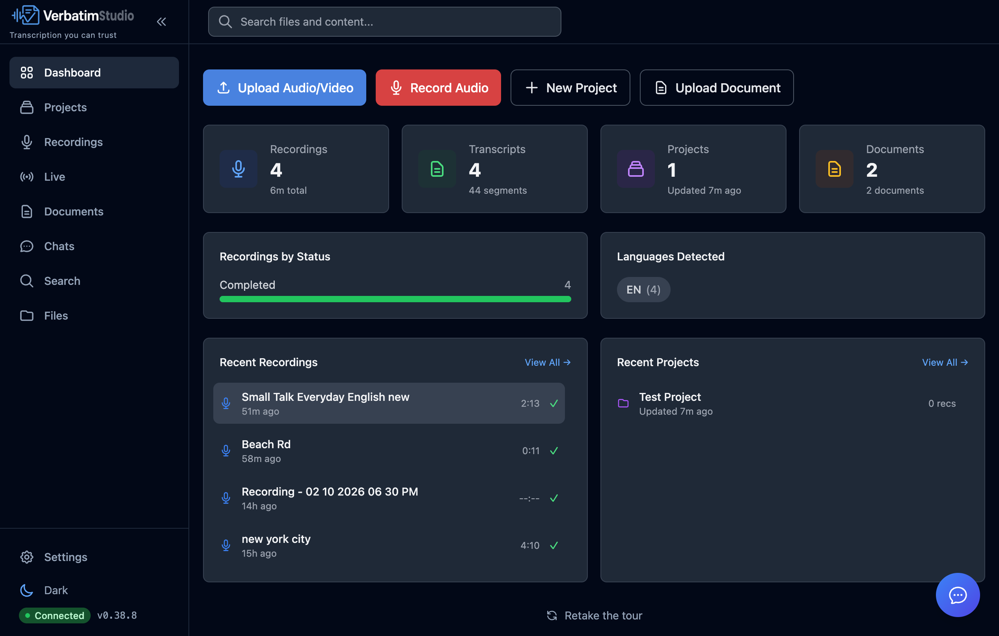

<h1 align="center">
  <br>
  Verbatim Studio
</h1>

<p align="center">
  <strong>Your data. Your device. Your rules.</strong>
</p>

<p align="center">
  <a href="#downloads">Downloads</a> •
  <a href="#features">Features</a> •
  <a href="#system-requirements">Requirements</a> •
  <a href="#first-launch">Getting Started</a>
</p>

<p align="center">
  
  
  
</p>

<p align="center">
  
</p>

---

## Why Verbatim Studio?

Organizations handling confidential information — law firms, medical practices, government agencies, research institutions — face a critical challenge: **cloud transcription services require sending sensitive data to third-party servers.**

Verbatim Studio eliminates this risk entirely. All transcription and AI processing happens locally on your machine. Your files never leave your control.

- **HIPAA-ready** — Patient interviews and medical dictation stay on-premises
- **Legal privilege** — Attorney-client communications remain confidential
- **Government security** — Classified briefings never touch external networks
- **Research ethics** — IRB-protected interviews maintain participant privacy

---

## Downloads

Download the latest release for your platform:

| Platform | Download | Notes |
|----------|----------|-------|
| **macOS** (Apple Silicon) | [Download .dmg](https://github.com/JongoDB/verbatim-studio-releases/releases/latest) | M1/M2/M3/M4 optimized |
| **Windows** (x64) | [Download .exe](https://github.com/JongoDB/verbatim-studio-releases/releases/latest) | NVIDIA GPU optional for faster transcription |

The app is self-contained — no Python, Node.js, or other dependencies required. Just download, install, and run.

### Auto-Updates

Verbatim Studio checks for updates automatically. You'll be notified when a new version is available with a summary of what's new.

---

## Features

### Transcription That Actually Works

- **OpenAI Whisper accuracy** — State-of-the-art speech recognition running entirely on your device
- **Multi-language support** — Transcribe in 12+ languages with automatic detection
- **Automatic speaker identification** — Know who said what without manual tagging
- **Live transcription** — Real-time speech-to-text from your microphone
- **Video support** — Drop in MP4, MOV, WebM, or MKV files

### Max: Your AI Research Assistant

- **Voice chat** — Talk to Max directly with full-duplex voice conversations
- **Query across your entire library** — Ask questions that span multiple files and documents
- **Web search** — Pull in current information when you need it
- **Persistent conversations** — Pick up where you left off with saved chat history
- **Document-aware** — Upload PDFs, images, and notes for Max to reference
- **OCR built-in** — Extract text from scanned documents and handwriting
- **Smart delegation** — Quick model for fast replies, full model for complex questions
- **Tool calling** — Max can search your library, export transcripts, and more

All powered by IBM Granite, running 100% locally. No API keys. No usage limits.

### Find Anything, Instantly

- **Semantic search** — Find content by meaning, not just exact keywords
- **Search everything** — Files, transcripts, documents, notes, and chat history in one place
- **Smart results** — Context snippets with keyword highlighting and semantic match indicators

### Professional Editing & Organization

- **Clickable timestamps** — Jump to any moment instantly
- **Highlights and bookmarks** — Mark important segments for quick reference
- **Entity extraction** — Automatically identify people, organizations, locations, and key terms
- **AI transcript quality review** — Automated accuracy scoring
- **Projects with custom metadata** — Templates for legal cases, medical records, interviews
- **Trash / recycle bin** — Soft-delete with 30-day auto-purge
- **Bulk operations** — Select multiple files and act on them at once
- **Full exports** — TXT, SRT, VTT, DOCX, PDF, JSON with AI summaries and speaker stats

---

## System Requirements

### Hardware

|  | Minimum | Recommended |
|---|---|---|
| **RAM** | 8 GB | 16 GB+ |
| **Disk** | ~2 GB (base install) | ~8 GB (all AI models) |

### Platform Support

| Platform | Requirement | Notes |
|----------|-------------|-------|
| **macOS** | Apple Silicon (M1/M2/M3/M4) | Optimized for Metal / MLX — Intel Macs not supported |
| **Windows** | x86-64 with 8 GB+ RAM | NVIDIA GPU optional — enables CUDA-accelerated transcription |

### Memory Usage by Feature

Each AI feature loads its own model. Deactivate models in **Settings > AI** to reclaim memory.

| Feature | Memory | Loaded when... |
|---------|--------|----------------|
| App (idle) | ~300 MB | Always |
| Transcription (Whisper base) | +200-300 MB | Transcribing audio/video |
| Speaker ID (pyannote) | +1 GB | Diarization enabled |
| Semantic search (nomic-embed) | +600 MB | Search index active |
| Max assistant (Granite 4.0) | +5 GB | AI chat / summaries |
| Voice chat (Kokoro TTS) | +1 GB | Voice sessions active |
| OCR (Qwen2-VL 2B) | +5 GB | Processing images / scanned PDFs |

> **Tip:** On a 16 GB machine you can comfortably run transcription + diarization + search + Max + voice simultaneously.

### Windows GPU / VRAM

Out of the box, only transcription uses your NVIDIA GPU (via CTranslate2). To accelerate **all** AI features on the GPU, open **Settings > AI** and click **Enable Full GPU Acceleration**.

---

## First Launch

On first launch, Verbatim Studio guides you through downloading the AI models you need. Choose what fits your workflow — transcription only, or the full suite with Max and semantic search.

<details>
<summary><strong>macOS: "App is damaged" or "unidentified developer" warning</strong></summary>

The app is not yet code-signed. To open it:

1. **Right-click** (or Control-click) the app and select **Open**
2. Click **Open** in the dialog that appears

Or remove the quarantine attribute via Terminal:

```bash
xattr -c ~/Downloads/Verbatim.Studio-<version>-arm64.dmg
```

</details>

---

## Source Code

The full source code is available at [JongoDB/verbatim-studio](https://github.com/JongoDB/verbatim-studio).

## License

Verbatim Studio is licensed under the [GNU Affero General Public License v3.0](https://github.com/JongoDB/verbatim-studio/blob/main/LICENSE).

---

<p align="center">
  <strong>Verbatim Studio</strong> — Transcription you can trust.
</p>

<p align="center">
  <a href="https://github.com/JongoDB/verbatim-studio/issues">Report Issue</a> •
  <a href="https://github.com/JongoDB/verbatim-studio/discussions">Discussions</a>
</p>
